# 
윤성훈(YUN SUNG HUN)

## INFO
 

    (소속) : 한림대학교 소프트웨어융합대학 
    (전공) : 빅데이터전공 
    (Email) : butter9709@gmail.com 

  

## Key Strengths
 

- ### 열정 :
    >   가장 큰 강점을 한가지만 내세우려 한다면, 시간이 지나도 녹슬지 않는 열정을 내세우고 싶습니다.
    24년 짧은 인생을 살아오면서, 일, 학업에 있어서 그 누구한테도 져 본적이 없습니다. 비록 처음 시작할 때에는 남들보다 뒤쳐질 수 있습니다. 하지만 열정에서 나오는 끊임없는 배움에 대한 욕구와, 목표에대한 집중력, 포기하지 않는 끈기가 남들보다 뛰어납니다. 때문에 장기적인 결과를 본다면 남들보다 몇배 더 뛰어난 결과를 만드는 경우가 많았습니다.  

- ### 창조성 :
    >   저 자신을 생각할 때, 자신의 가치가 "무언가를 만들어 낼 수 있는가?"에 많은 비중을 두고 있는 사람 입니다. 때문에 소프트웨어 융합대학에 오게 되었고, 흥미 있는 것들을 찾아 많은것을 만들기 위해, 배움의 연속에서 살고 있습니다.  

  

## Skills
 

- ### 영상처리 :
    >   3학년 1학기를 마치고, 이미지 처리에 매료되어 공부및, 개발에 참여하고 있습니다. 현재 공부하고 있는 것은, Image registration Algorithm(SIFT), Neural Net을 활용한 객체 인식, FFT를 활용한 이미지 분석 입니다. 또한 Real-Time Camera PCR 의 이미지 밝기 추출 개발에 참여하고 있습니다. 위와 같은 노력으로 영상처리를 공부하며 가장 강한 강점으로 만들기 위해 노력중 입니다.  

- ### IoT :
    >   군대를 다녀온 후, BioIT 연구실에서 Real-Time PCR 개발에 참여하고 있습니다. 개발에 참여 하면서, Sensor Control, Web GUI 개발, 여러가지 데이터 네트워크를 배웠습니다. 현재는 개발에 사용될 Fastech사의 Motor Library를 Python으로 바꾸고 있습니다. 또한 PCR Bio 실험을 통해 나온 DNA 증폭 데이터로, Neural Net 통계 및 분석을 하고 있습니다.  

  

## Work Experience
 

- Organisation : 육군(3군단)
    - Role : 네트워크 관리병
        - 군단내 유무선 네트워크 설치 및 관리
        - 군단내 전장망, 인트라넷 L2, L3, 백본 스위치 및 라우터 관리

- Organisation : BIT 융합연구소
    - Role : 학부 연구생
        - Real-Time Camera PCR 이미지 처리
        - Real-Time PCR Bio실험 및 분석, 통계
        - Web GUI 개발

  

## Education and Training
 

학교명 | 학년 | 상태 |
:------------: | :--: | :--:|
정발고등학교 | 3  | 졸업 | 
한림대학교 | 3학년 2학기 | 재학 | 

  

## Interests
 

- Weight training
- Video editing
- Music

  

## License
 

- TOEIC : 700
- 정보처리 기사

  

## Development list
 

### 미세먼지 예측 프로젝트
- 서울시 종로구의 15~19년도의 미세먼지 기상청 데이터로 진행
- 기상청 데이터중 미세먼지와 관련있는 Feature를 골라 진행
- 미세먼지 농도 분류문제에서 최대 75%의 정확도를 보임
  
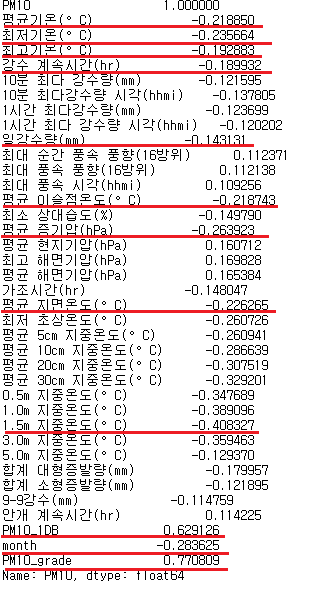
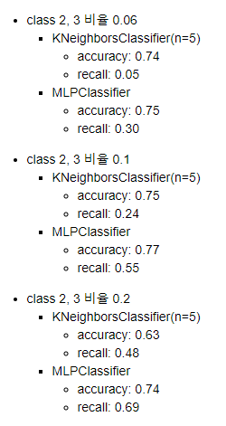
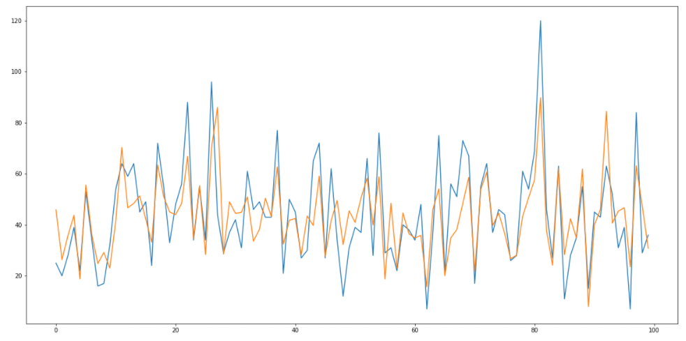
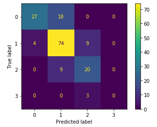

  

### Life Safty Monitoring Service
- 치매노인, 장애우들의 실종률이 높다는 기사를 접하고, 이를 방지하기 위해 제작
- GPS, 온도, 심박수 센서를 이용하여 기기 제작
- React, Naver api app을 이용하여 Web GUI 만듬
- MQTT 프로토콜, Mongo DB, nodejs 등을 사용하여 서버 구축
  

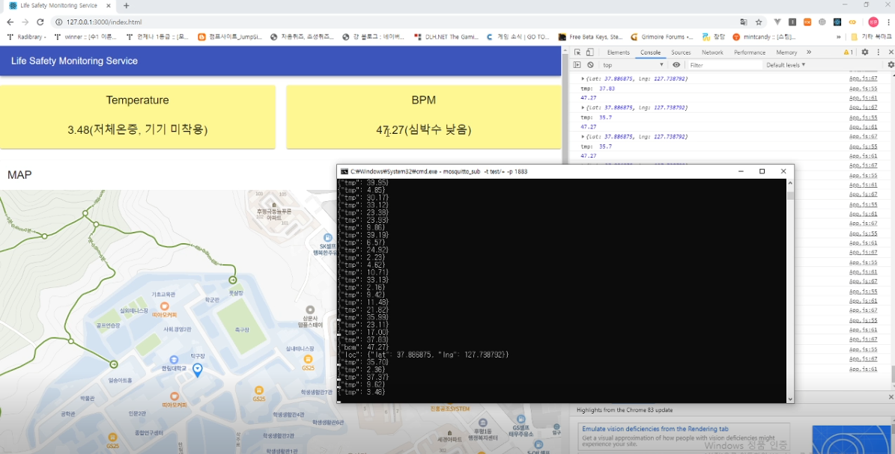

### Real-Time Camera PCR Image processing

- Photodiode 대신 Camera 를 사용한 Real-Time PCR Image 처리
- Camera가 틀어짐을 고려하고 자동으로 중앙점을 찾아 4부분의 밝기를 자동으로 찾아주는것이 목적
- Image Thresholding(Otsu), 잡음처리, 다양한 이미지분석을 통해 진행

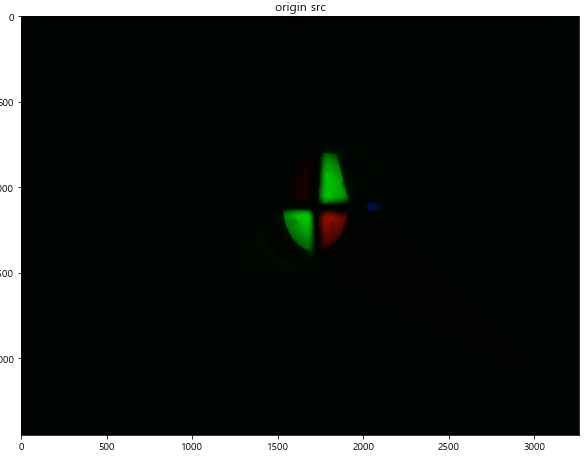
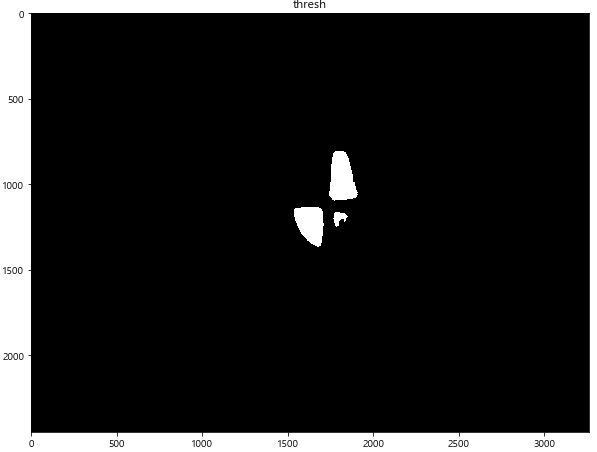
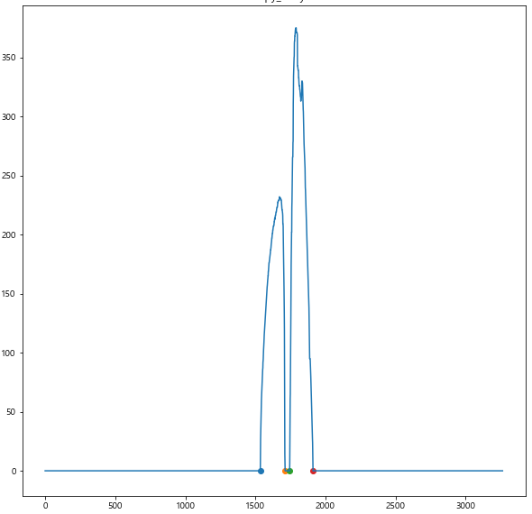
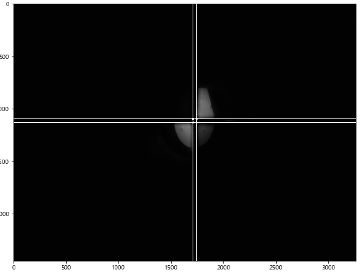
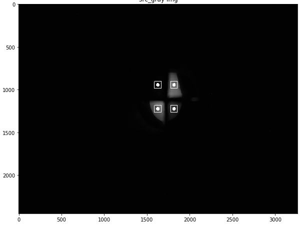

### EIT Web GUI 및 Server 개발

- 세포 프린팅을 위한 세포 임피던스 측정을 위해 개발
- Web GUI는 React, Material UI를 사용함
- Server는 backend : Django, fornt : nodejs 사용하여 개발

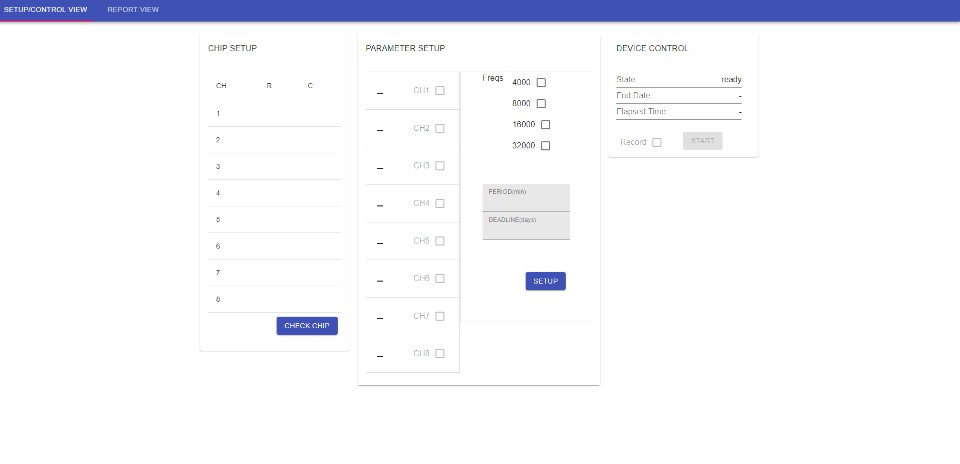
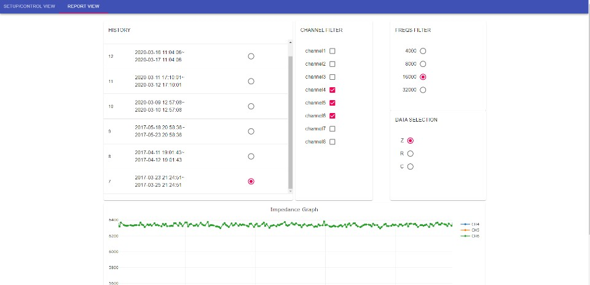
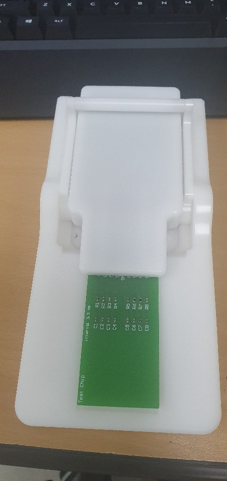
